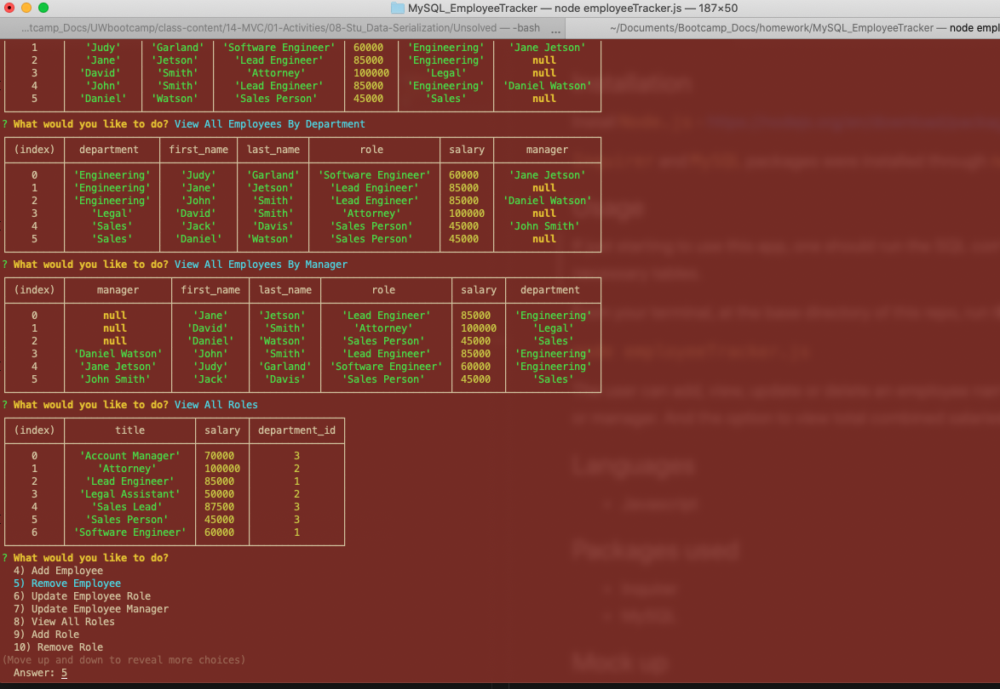

# Employee-Tracker

## Description
This is a database application that can help a user keep track of employee information using `node`, `inquirer` and `MySQL`.  

## Installation
Install `Node.js` - https://nodejs.org/en/download/package-manager/ 

`Inquirer` and `MySQL` packages were installed through `npm install`.  (See package.json)

## Usage
If just starting to use this app, one should run the SQL commands in `employeeDBSchema.sql` to
create the `employeeDB` with its necessary tables.

From your terminal, at the base directory of this repo, run the following to start the `MySQL_EmployeeTracker`:

```node employeeTracker.js```

The user can add, view, update or delete an employee name, department or role.  A user can also choose to view by department, role or manager. And the option to view total combined salaries for each department is also available.


## Languages
* Javascript

## Packages used
* Inquirer
* MySQL

## Mock up



Link to video of application in use:

https://drive.google.com/file/d/1GCd6_gl18LR-PfxawpB-vVJN__tDQIg4/view

